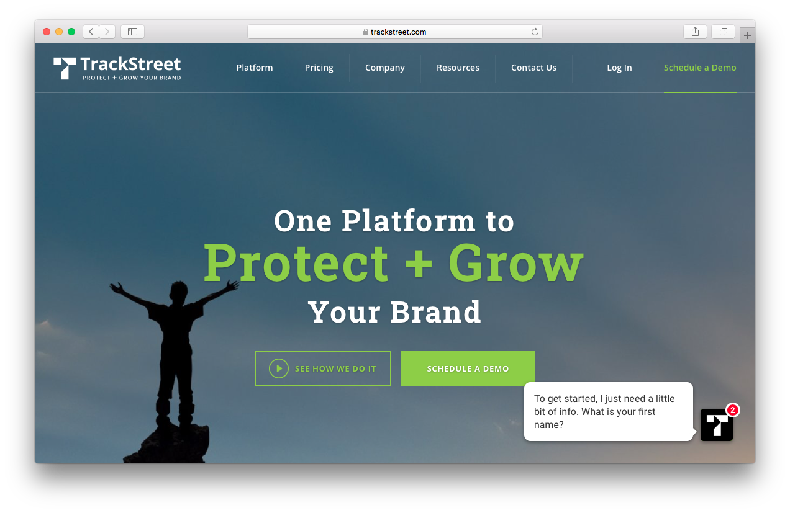
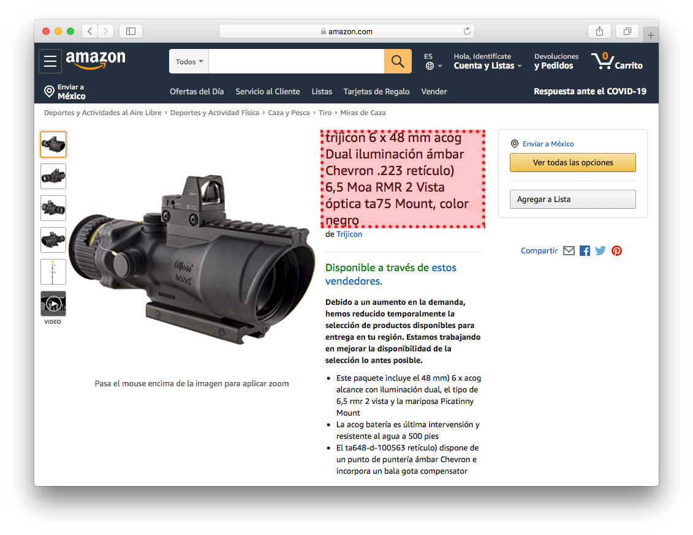
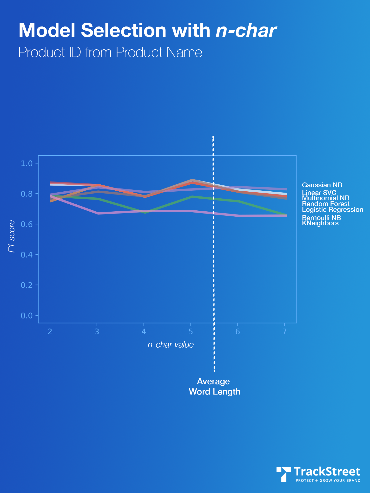
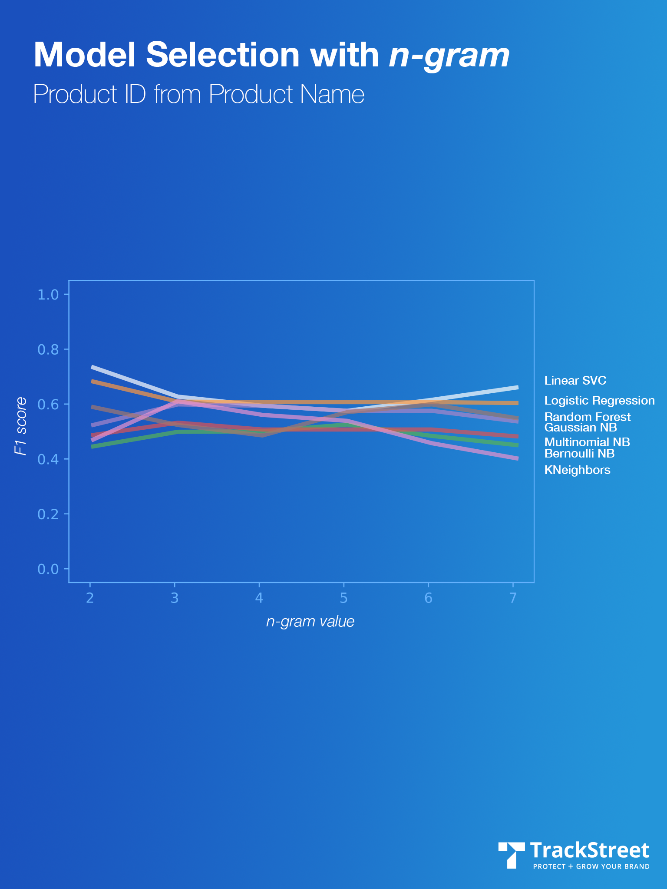

# UMBA - Code example

[TrackStreet](https://www.trackstreet.com) has built an industry leading *SaaS* platform that leverages the power of artificial intelligence and automation to radically reduce brand and pricing policy violations. 



In order to achieve this, a series of web crawlers were set up to download the information of different products featured in a series of online stores (BestBuy, Amazon, Target, ...), and analyze their name, description, price and image. In order to know if a product belonged to one of the clients, in **my role as a Data Scientist**, I was commissioned to solve a supervised text classification problem, with the goal of working out which supervised machine learning methods were best suited to solve it.

### Problems that were solved

* Finding a way to choose between ML models (different model types, tuning parameters, and features) to *predict* **Product ID** from **Product Name**.
* Applying a **Model Evaluation Procedure** to estimate how well a model will generalize to *out-of-sample* data.
* Choosing and fine tuning a **Model Evaluation Metric** to quantify the model performance.

### Review of the ML Metrics

* **Model evaluation procedure**: K-fold cross-validation
* **Model evaluation metrics**: F1 Score

### Workflow

1. [Reading a text-based dataset](#1-reading-a-text-based-dataset)
2. [Dataset preparation and pre-processing](#2-dataset-preparation-and-pre-processing)
3. [Choosing *n-gram* or *n-char* approximation for vectorize](#3-choosing-n-gram-or-n-char-approximation-for-vectorize)
4. [Building and comparing models](#4-building-and-comparing-models)
5. Identifing Outliers
6. Improving hyperparameters
7. Building a class
8. Runing a cron job for trainning

## Hands On

### 1. Reading a text-based dataset

One of the goals of the TrackStreet Web Crawlers is to download the name of the products found on a certain web site, for example:



In the previous example the following **Product Name**  was found; while the objective of the overall model is to predict the **Product ID**.

Product Name (*X*) | Product ID (*Y*)
--- | --- 
trijicon 6 x 48 mm acog | **UNKNOWN**


An excerpt of the used *training data* is shown below:

Product Name (*X*) | UPC | Product ID (*Y*)
--- | --- | ---
Trijicon ACOG | 658010111379 | 4
Trijicon ACOG 6x48mm Chevron | 658010111546 | 4
Trijicon 6X48 acog. TA648-50G | 658010111249 | 4
Ultimate Flora Women's Care Probiotic 15 Billion | 631257158789 | 52
Renew Life Women's Care Ultimate Flora Probiotic | 658010111379 | 52
Ultimate Flora Probiotic 15 Billion | 658012531373 | 52
Renew Life Everyday Ultimate Flora Probiotic | 631257158772 | 52

### 2. Dataset preparation and pre-processing

First, duplicated values were removed.


```python

def clean_duplicated_data(self, df):
    df['is_duplicated'] = df.duplicated(['X'])    
    return df.loc[df['is_duplicated'] == False]

```


Second, as we see from the *training data*, we are faced with a non-classical text processing problem, therefore we do not follow the recommendations made by regular analysis of scientific texts to attack this type of problem. For example, one of the most common recommendations is to remove numbers; in this case, however, it doesn't make much sense because numbers are a significant identifier of the product.

Instead, the following steps were implemented:


* Converting to lower case
* Removing punctuation signs
* Removing stop words
* Removing the 10 most common words inside the data set
* Removing the 10 most rare words inside the data set


```python

def pre_processing_data(self, X,common_freq_count=10,rare_freq_count=10):
    # Lower Case
    X = X.apply(lambda x: " ".join(x.lower() for x in x.split()))
    print(type(X))
    # Removing Punctuation
    X = X.str.replace('[^\w\s]','')
    # Removing Stop Words
    X = X.apply(lambda x: " ".join(x for x in x.split() if x not in stop))
    # Common Word Removal
    common_freq = pd.Series(' '.join(X).split()).value_counts()[:common_freq_count]
    common_freq = list(common_freq.index)
    X = X.apply(lambda x: " ".join(x for x in x.split() if x not in common_freq))
    # Rare words Removal
    rare_freq = pd.Series(' '.join(X).split()).value_counts()[-rare_freq_count:]
    rare_freq = list(rare_freq.index)
    X = X.apply(lambda x: " ".join(x for x in x.split() if x not in rare_freq))
    
    return X
```


### 3. Choosing *n-gram* or *n-char* approximation for vectorize

In this step, raw text data was transformed into feature vectors and new features were created using the existing dataset. The following ideas were implemented in order to obtain relevant features from our dataset.

* Count Vectors as features
* TF-IDF Vectors as features
    * Word level
    * N-Gram level
    * Character level (n-char)

**Count Vectors as features**

Count Vector is a matrix notation of the dataset in which every row represents a document from the corpus, every column represents a term from the corpus, and every cell represents the frequency count of a particular term in a particular document.

```python
def transform_to_count_vectors(self,X):
    count_vect = CountVectorizer(analyzer='word', token_pattern=r'\w{1,}')
    return count_vect.fit(X)
```


**TF-IDF Vectors as features**

TF-IDF score represents the relative importance of a term in the document and the entire corpus. TF-IDF score is composed by two terms: the first computes the normalized Term Frequency (TF), the second term is the Inverse Document Frequency (IDF), computed as the logarithm of the number of the documents in the corpus divided by the number of documents where the specific term appears. TF-IDF Vectors can be generated at different levels of input tokens (words, characters, n-grams).


* Word level: Matrix representing TF-IDF scores of every term in different documents
* N-Gram level: N-grams are the combination of N terms together. Matrix representing TF-IDF scores of N-grams
* Character level (n-char): Matrix representing TF-IDF scores of character level n-grams in the corpus


```python


def vectorize(self, X, level = 'nchar'):

    min_df, max_df = self.select_tfidf_params(X)

    try:
        if level == 'word':
            # word level tf-idf
            self.tfidf = TfidfVectorizer(analyzer='word', token_pattern=r'\w{1,}', min_df=min_df, max_df=max_df, sublinear_tf=True, norm='l2', encoding='latin-1',max_features=5000, stop_words='english')

        elif level == 'ngram':
            # ngram level tf-idf 
            self.tfidf = TfidfVectorizer(analyzer='word', token_pattern=r'\w{1,}', min_df=min_df, max_df=max_df, sublinear_tf=True, norm='l2', encoding='latin-1',ngram_range=(2,3), max_features=5000, stop_words='english')

        elif level == 'nchar':
            # characters level tf-idf
            self.tfidf = TfidfVectorizer(analyzer='char', token_pattern=r'\w{1,}', min_df=min_df, max_df=max_df, sublinear_tf=True, norm='l2', encoding='latin-1',ngram_range=(2,3), max_features=5000, stop_words='english')

        X = self.tfidf.fit_transform(X).toarray()
    
    
    except ValueError:
        self.tfidf = TfidfVectorizer(sublinear_tf=True, min_df=0.1, max_df=0.5, norm='l2', encoding='latin-1',
                                         ngram_range=(1, 2),
                                         stop_words='english')
        X = self.tfidf.fit_transform(X).toarray()
    return X

```


The **best** result was obtained using a **value of 5 in the *n-char* level** as shown in the following graphs:






### 4. Building and comparing models


	
## Technologies
Project created with:
* Lorem version: 12.3
* Ipsum version: 2.33
* Ament library version: 999


```python
# Model evaluation metrics: F1 Score
from sklearn.metrics import f1_score


def f1_multilabel(estimador, X, y):
    preds = estimador.predict(X)
    return f1_score(y, preds, average="micro")
```
	
## Setup
To run this project, install it locally using npm:

```
$ cd ../lorem
$ npm install
$ npm start
```

# BONUS


As you can see, I breath and live technology; but all the babble about the next best way of using AI, ML, or Data for the sole purpose of monetizing and implement it around the world absolutely bores me to tears... 


I can be reading a really cool article on *Wired Magazine* about this new fridge that uses AI to predict when you need to buy more sparkling water or something and, for me, it is like watching paint dry. I couldn't care less. What I *do* care about is what you do with it: how do you take this algorithm based technology and make it live in places it's never been before... What I'm really interested in is the convergence of *Data* and *AI/ML* and ethics as a tool for creative troubleshooting. For example: 


**1)** In order to understand the *social mobility* based on skin tone, [I calculated the PANTONE®* of mexican political parties](https://www.youtube.com/watch?v=AZcDNoGPaVg) 

**2)** I used Big Data on *Twitter* in order to see [the age at which sexual assaults begins in Mexico](https://translate.google.com/translate?hl=en&sl=es&tl=en&u=https://verne.elpais.com/verne/2016/05/19/mexico/1463615258_699475.html) 

**3)** Or I made a *LinkedIn*'s web scraping to realize if exists a [*shortcut* to be CEO in Mexico](https://translate.google.com/translate?hl=en&sl=es&tl=en&u=https%3A%2F%2Fwww.unocero.com%2Fredes-sociales%2Fblancos-hombres-de-escuelas-privadas-y-bilingues-asi-son-los-ceos-en-mexico%2F&sandbox=1) 


